<h1 align="center">🏦 Advanced Bank Management System</h1>

<p align="center">
A feature-rich console-based <strong>Bank Management System</strong> developed in <strong>C</strong> using <strong>File Handling</strong>, <strong>libcurl</strong>, and the <strong>Telegram Bot API</strong>. The project simulates real-world banking operations while providing secure account management, transaction logging, CSV export, and real-time Telegram notifications.
</p>

<p align="center">


</p>

---

# 📖 Project Overview

The **Advanced Bank Management System** is a menu-driven banking application developed using the C programming language. The system provides an efficient way to manage customer accounts, perform banking transactions, maintain transaction history, and export customer records.

A unique feature of this project is the integration of the **Telegram Bot API** using **libcurl**, enabling customers to receive instant notifications whenever important banking operations are performed.

The project demonstrates practical implementation of:

- File Handling
- Structures
- Functions
- Authentication
- Data Validation
- Binary File Storage
- Activity Logging
- REST API Integration
- CSV Export
- Console-Based User Interface

---

# 🎯 Objectives

- Develop a secure banking management application using C.
- Implement persistent data storage using binary files.
- Provide secure customer authentication using PIN verification.
- Maintain complete transaction history.
- Generate CSV reports for customer records.
- Send real-time Telegram notifications for banking transactions.
- Demonstrate practical use of API integration in C.

---

# ✨ Features

- ✅ Create New Customer Account
- ✅ Secure PIN Authentication
- ✅ Customer Login
- ✅ Deposit Money
- ✅ Withdraw Money
- ✅ Fund Transfer
- ✅ Balance Inquiry
- ✅ Change Account PIN
- ✅ Delete Customer Account
- ✅ Unlock Locked Accounts
- ✅ Admin Dashboard
- ✅ Activity Log
- ✅ Export Customer Data (CSV)
- ✅ Export Markdown Report
- ✅ Real-Time Telegram Notifications
- ✅ Binary File Storage
- ✅ Input Validation

---

# 🛠 Technologies Used

| Technology | Purpose |
|------------|---------|
| C Programming | Core Development |
| GCC (MinGW-w64) | Compilation |
| File Handling | Data Storage |
| Binary Files | Customer Database |
| libcurl | HTTP Requests |
| Telegram Bot API | Notifications |
| CSV | Data Export |
| Markdown | Report Generation |
| Git & GitHub | Version Control |

---

# 📂 Project Structure

```
Bank-Management-System/
│
├── banking1.c
├── README.md
├── LICENSE
├── .gitignore
├── bank_accounts.dat
├── bank_export.csv
├── bank_export.md
├── bank_log.txt
├── libcurl-x64.dll
└── screenshoot/
    ├── mainmenu.png
    ├── create_account.png
    ├── account_created.png
    ├── deposit_money.png
    ├── withdraw_money.png
    ├── change_pin.png
    ├── Delete_account.png
    ├── unlock_account.png
    ├── Admin_view.png
    ├── Activity.png
    ├── export_csv.png
    └── telegram_notification.png
```

---

# ⚙️ Installation

1. Clone the repository

```bash
git clone https://github.com/anchalicapatil2007-cell/Bank-Management-System.git
```

2. Open the project folder.

3. Install GCC (MinGW-w64).

4. Download **libcurl** for MinGW.

5. Place `libcurl-x64.dll` beside the executable.

---

# 🔨 Compilation

```bash
gcc banking1.c -I"C:\curl\include" -L"C:\curl\lib" -o banking.exe -lcurl
```

---

# ▶ Running

```bash
banking.exe
```

---

# 🔐 Security Features

- 4-Digit PIN Authentication
- Account Lock after Multiple Failed Attempts
- Secure PIN Change
- Activity Logging
- Administrator Controls
- Input Validation
- Binary File Storage

---

# 📲 Telegram Integration

The application integrates the **Telegram Bot API** through **libcurl**.

Whenever an important banking operation is performed, such as:

- Account Creation
- Deposit
- Withdrawal
- Fund Transfer
- PIN Change

the application automatically sends a notification to the registered Telegram chat.

---

# 📊 Export Features

The system allows administrators to:

- Export customer records to CSV.
- Generate Markdown reports.
- Maintain transaction logs.
- View activity history.

---

# 📸 Application Screenshots

## 🏠 Main Menu

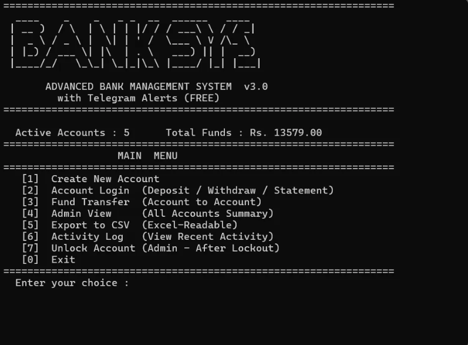

---

## 👤 Create Account

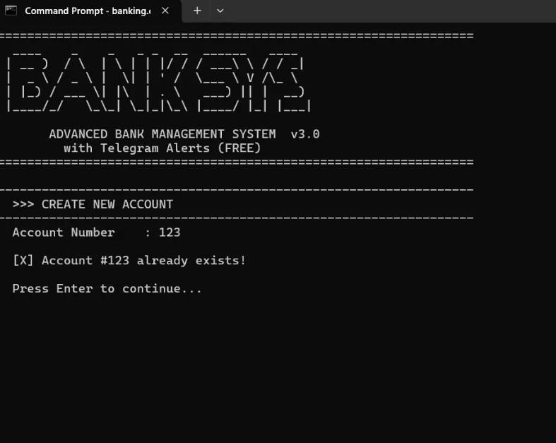

---

## ✅ Account Created

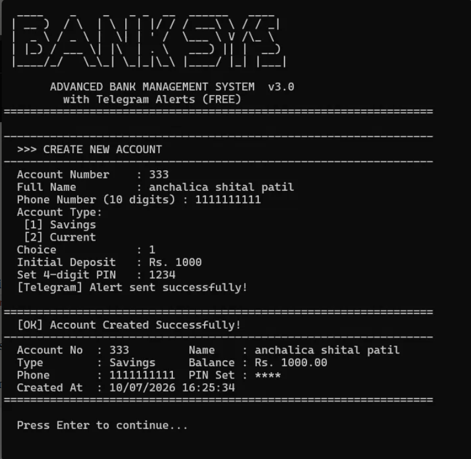

---

## 💰 Deposit Money

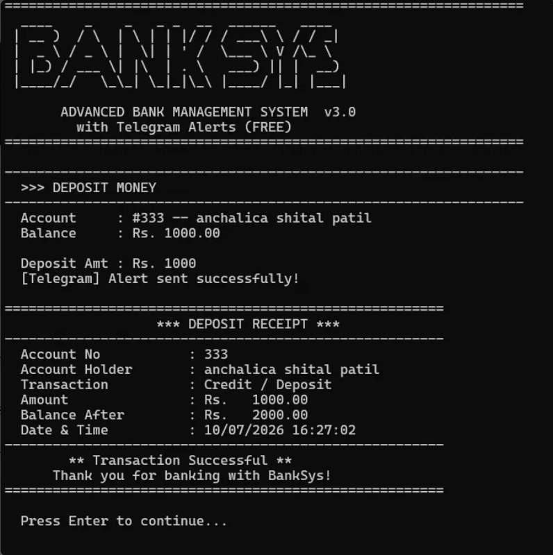

---

## 💸 Withdraw Money

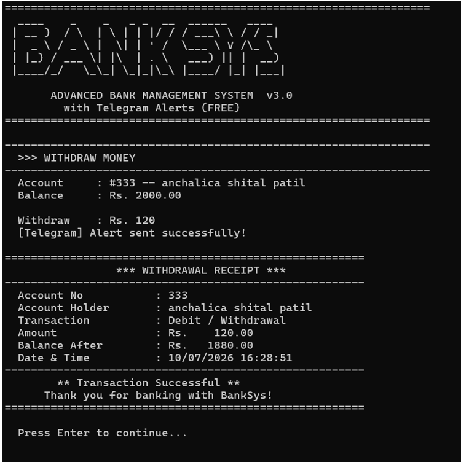

---

## 🔐 Change PIN

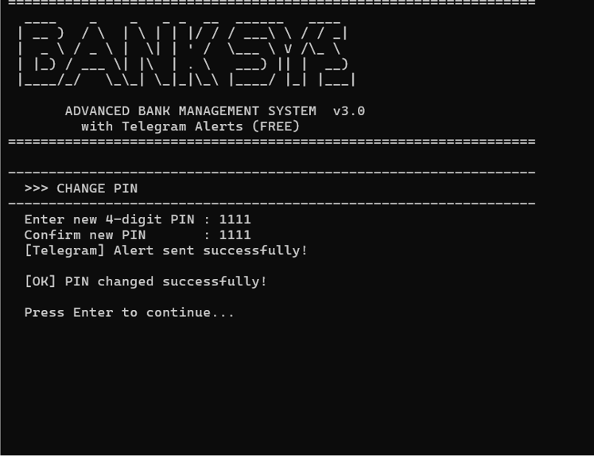

---

## 🗑 Delete Account

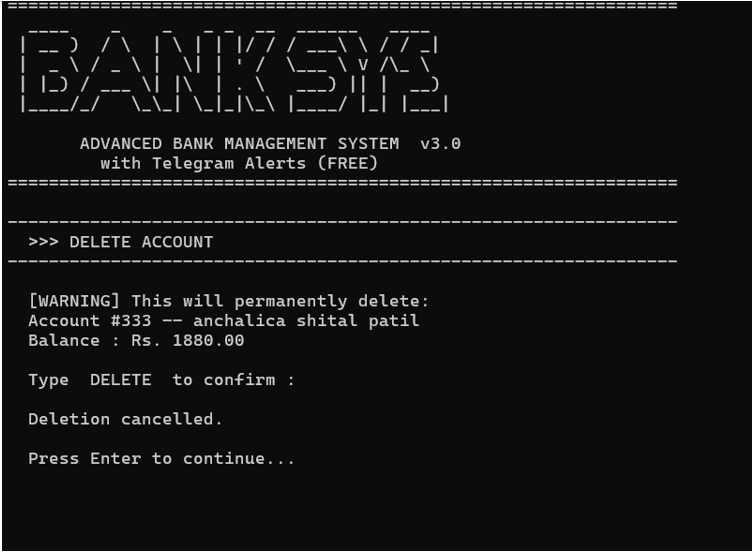

---

## 🔓 Unlock Account

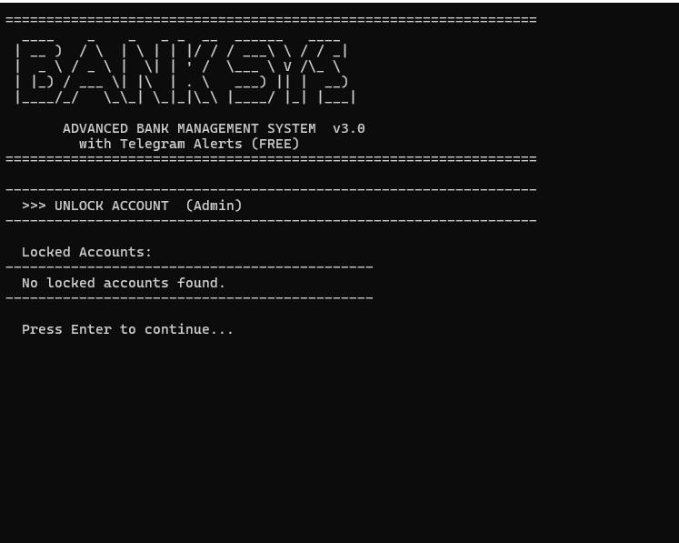

---

## 👨‍💼 Admin Dashboard

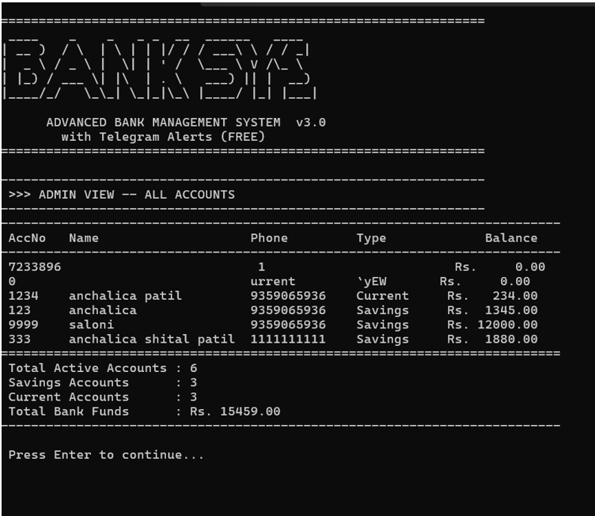

---

## 📋 Activity Log

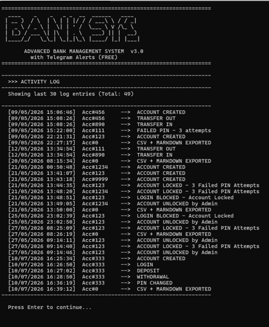

---

## 📊 Export CSV

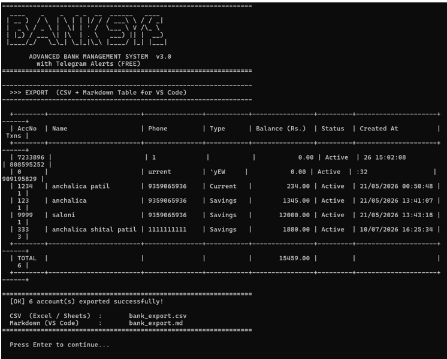

---

## 📲 Telegram Notification

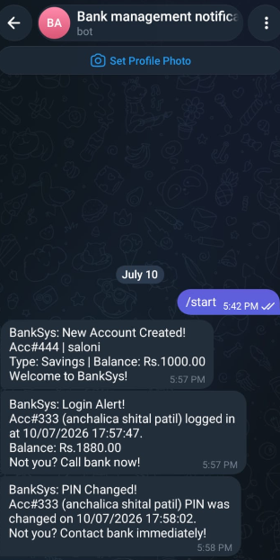

---

# 🚀 Future Enhancements

- Database Integration (MySQL/SQLite)
- Password Encryption
- Interest Calculation
- Loan Management
- ATM Simulation
- Internet Banking
- Mobile Banking Application
- Graphical User Interface
- Multi-User Support
- Cloud Backup

---

# 📚 Learning Outcomes

This project helped in understanding:

- C Programming
- File Handling
- Data Structures
- Authentication Systems
- REST API Integration
- libcurl Library
- Telegram Bot API
- CSV Generation
- Git & GitHub
- Software Documentation

---

# 👩‍💻 Author

**Anchalica Shital Patil**

Second Year – Artificial Intelligence & Data Science

Vishwakarma Institute of Technology, Pune

GitHub: https://github.com/anchalicapatil2007-cell

---

# 📜 License

This project is licensed under the **MIT License**.

---

# ⭐ Support

If you found this project useful, consider giving it a ⭐ on GitHub.

Your support motivates future improvements and open-source contributions.
